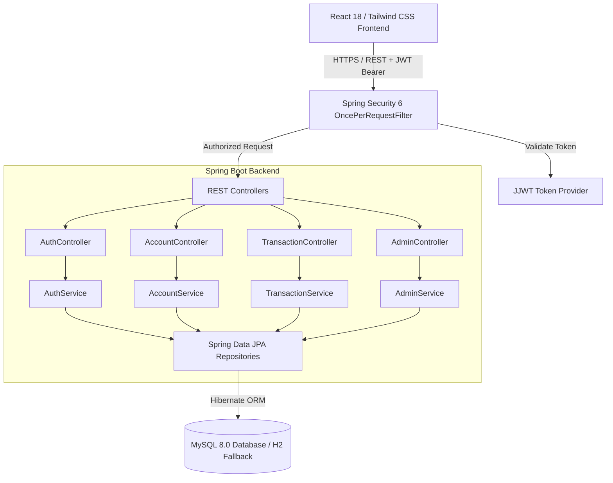

# Secure Banking Management System (NexBank)

[](https://www.oracle.com/java/)
[](https://spring.io/projects/spring-boot)
[](https://spring.io/projects/spring-security)
[](https://hibernate.org/)
[](https://www.mysql.com/)
[](https://react.dev/)
[](https://tailwindcss.com/)
[](https://vitejs.dev/)
[](https://opensource.org/licenses/MIT)

A production-grade, full-stack **Secure Banking Management System** featuring robust backend security, ACID-compliant transactions, role-based access control (RBAC), and a sleek modern fintech user interface inspired by institutional banking and trading platforms.

Developed by **[Vaibhav Lakde](https://linkedin.com/in/vaibhav-lakde-1a4406331)** (Java Full Stack Developer).

👉 **[Read the Complete System Documentation (DOCUMENTATION.md)](DOCUMENTATION.md)** &bull; 📄 **[Download Official PDF Manual (Secure_Banking_System_Documentation.pdf)](Secure_Banking_System_Documentation.pdf)**

---

## 📌 Project Overview (As Featured in Resume)

- **Login and Role-Based Authentication:** JWT-based stateless authentication using Spring Security 6 with role differentiation (`ROLE_CUSTOMER`, `ROLE_ADMIN`, `ROLE_BANKER`).
- **Account Management & Transaction Operations:** High-performance RESTful APIs for account provisioning, balance tracking, deposits, ATM withdrawals, and atomic peer-to-peer fund transfers.
- **Persistent Data Management:** Complete MySQL 8.0 relational schema mapped via Hibernate ORM / Spring Data JPA with transactional rollback mechanisms and double-entry ledgering.
- **Responsive Fintech Frontend:** Modern React.js single-page application built with Tailwind CSS, Lucide icons, virtual platinum debit card simulation, real-time beneficiary lookup, and digital receipt generation.

---

## 🛠️ Technology Stack

| Layer | Technologies |
| :--- | :--- |
| **Backend Framework** | Spring Boot 3.3.4, Java 17 |
| **Security & Auth** | Spring Security 6, JJWT (io.jsonwebtoken 0.12.6), BCrypt Password Hashing |
| **Persistence & ORM** | Hibernate 6.5, Spring Data JPA, Jakarta Persistence |
| **Database** | MySQL 8.0 (with out-of-the-box in-memory H2 profile fallback) |
| **Validation** | Hibernate Validator, Spring Boot Starter Validation (`@Valid`, `@NotBlank`, etc.) |
| **Frontend UI** | React 18, Vite, Tailwind CSS, Lucide React Icons |
| **Build & CI/CD** | Maven 3.9+, Node.js 20+, GitHub Actions CI |

---

## 🏛️ System Architecture



---

## 🚀 Key Features

### 1. Security & Authentication (Defense in Depth)
- **Stateless JWT Tokens:** 256-bit HMAC SHA secret signing with customizable token expiration.
- **BCrypt Encryption:** Industry-standard password hashing with salt before database persistence.
- **Role-Based Access Control (RBAC):** Restricts administrative operations (account freezing, reserve statistics) strictly to `ROLE_ADMIN` and `ROLE_BANKER`.
- **CORS Configured:** Pre-configured cross-origin resource sharing allowing secure communication with React.

### 2. Banking Core & Transactions
- **Atomic Fund Transfers (`@Transactional`):** Double-entry accounting ensures debit and credit operations either both succeed or rollback completely if any exception occurs.
- **Overdraft & Balance Protection:** Rigorous server-side balance checks prevent negative balances or unauthorized withdrawals.
- **Account State Machine:** Handles `ACTIVE`, `FROZEN`, `PENDING_APPROVAL`, and `CLOSED` states. Frozen accounts are strictly prohibited from debits/transfers.
- **Beneficiary Verification:** Real-time verification of recipient account numbers before initiating transfers.

### 3. Fintech Frontend & User Experience
- **Interactive Platinum Debit Card:** Displays dynamic cardholder details, copyable 10-digit account number, toggleable visibility, EMV chip, and IFSC code (`SBMS0001024`).
- **One-Click Demo Logins:** Instantly switch between Customer (`vaibhav@gmail.com`) and Bank Admin (`admin@bank.com`).
- **Digital Transaction Receipts:** Instant modal receipt with reference UTR number, cryptographic verification stamp, and print/save capabilities.
- **Admin Control Center:** Live bank reserve monitoring, global audit trail, and account freeze/unfreeze controls.

---

## 📋 REST API Endpoints

### Authentication (`/api/auth`)
| Method | Endpoint | Description | Access |
| :--- | :--- | :--- | :--- |
| `POST` | `/api/auth/register` | Register new customer & auto-provision account | Public |
| `POST` | `/api/auth/login` | Authenticate with email & password, return JWT | Public |
| `GET` | `/api/auth/me` | Fetch authenticated user profile | Authenticated |

### Accounts (`/api/accounts`)
| Method | Endpoint | Description | Access |
| :--- | :--- | :--- | :--- |
| `GET` | `/api/accounts/my-accounts` | List accounts belonging to logged-in user | Customer / Admin |
| `GET` | `/api/accounts/{accountNumber}` | Retrieve account balance & metadata | Owner / Admin |
| `GET` | `/api/accounts/verify/{accountNumber}` | Verify beneficiary name before transfer | Authenticated |
| `POST` | `/api/accounts/new` | Open additional savings/current account | Authenticated |

### Transactions (`/api/transactions`)
| Method | Endpoint | Description | Access |
| :--- | :--- | :--- | :--- |
| `POST` | `/api/transactions/deposit` | Deposit funds into an account | Authenticated |
| `POST` | `/api/transactions/withdraw` | Withdraw cash (checks balance) | Account Owner |
| `POST` | `/api/transactions/transfer` | Execute atomic inter-account transfer | Account Owner |
| `GET` | `/api/transactions/history/{accountNumber}` | Fetch chronological ledger | Account Owner |
| `GET` | `/api/transactions/receipt/{referenceNumber}` | Fetch digital transaction receipt | Authenticated |

### Administration (`/api/admin`)
| Method | Endpoint | Description | Access |
| :--- | :--- | :--- | :--- |
| `GET` | `/api/admin/dashboard` | Bank reserve metrics & KPIs | `ROLE_ADMIN` |
| `GET` | `/api/admin/accounts` | Retrieve all system bank accounts | `ROLE_ADMIN` |
| `GET` | `/api/admin/transactions` | Global immutable transaction audit log | `ROLE_ADMIN` |
| `PATCH` | `/api/admin/accounts/{accountNumber}/status` | Freeze or unfreeze customer account | `ROLE_ADMIN` |

---

## 🗄️ Database Schema (MySQL 8.0)

```sql
-- Users Table
CREATE TABLE users (
    id BIGINT AUTO_INCREMENT PRIMARY KEY,
    full_name VARCHAR(100) NOT NULL,
    email VARCHAR(120) NOT NULL UNIQUE,
    password VARCHAR(255) NOT NULL,
    phone VARCHAR(20),
    role VARCHAR(30) NOT NULL DEFAULT 'ROLE_CUSTOMER',
    created_at TIMESTAMP DEFAULT CURRENT_TIMESTAMP
);

-- Accounts Table
CREATE TABLE accounts (
    id BIGINT AUTO_INCREMENT PRIMARY KEY,
    account_number VARCHAR(20) NOT NULL UNIQUE,
    ifsc_code VARCHAR(15) NOT NULL DEFAULT 'SBMS0001024',
    account_type VARCHAR(20) NOT NULL DEFAULT 'SAVINGS',
    balance DECIMAL(15, 2) NOT NULL DEFAULT 0.00,
    status VARCHAR(20) NOT NULL DEFAULT 'ACTIVE',
    user_id BIGINT NOT NULL,
    created_at TIMESTAMP DEFAULT CURRENT_TIMESTAMP,
    updated_at TIMESTAMP DEFAULT CURRENT_TIMESTAMP ON UPDATE CURRENT_TIMESTAMP,
    FOREIGN KEY (user_id) REFERENCES users(id) ON DELETE CASCADE
);

-- Transactions Ledger
CREATE TABLE transactions (
    id BIGINT AUTO_INCREMENT PRIMARY KEY,
    reference_number VARCHAR(36) NOT NULL UNIQUE,
    account_id BIGINT NOT NULL,
    target_account_number VARCHAR(20),
    transaction_type VARCHAR(25) NOT NULL,
    amount DECIMAL(15, 2) NOT NULL,
    post_balance DECIMAL(15, 2) NOT NULL,
    description VARCHAR(255),
    status VARCHAR(20) NOT NULL DEFAULT 'SUCCESS',
    timestamp TIMESTAMP DEFAULT CURRENT_TIMESTAMP,
    FOREIGN KEY (account_id) REFERENCES accounts(id) ON DELETE CASCADE
);
```

---

## 💻 Quick Start & Running Locally

### Prerequisites
- **Java 17+** (OpenJDK / Eclipse Temurin / Oracle)
- **Maven 3.8+**
- **Node.js 18+** & npm
- **MySQL 8.0+** (Optional: application defaults to H2 persistent in-memory database out of the box)

### 1. Clone Repository
```bash
git clone https://github.com/vaibhavlakde/secure-banking-management-system.git
cd secure-banking-management-system
```

### 2. Run Backend (Spring Boot 3)
```bash
cd backend
mvn clean spring-boot:run
```
> The backend server starts at **`http://localhost:8080`**.  
> Test API health check: **`http://localhost:8080/api/health`**

### 3. Run Frontend (React + Vite)
```bash
cd ../frontend
npm install
npm run dev
```
> Open your browser at **`http://localhost:5173`**.

---

## 🔑 Demo Credentials

| Role | Email | Password | Primary Account |
| :--- | :--- | :--- | :--- |
| **Customer** | `vaibhav@gmail.com` | `Vaibhav@123` | `1001002026` (Bal: ₹75,450.00) |
| **Customer 2** | `priya@gmail.com` | `Priya@123` | `1001002027` (Bal: ₹42,800.00) |
| **Bank Admin** | `admin@bank.com` | `Admin@123` | Full System Oversight & Freeze Controls |

*(The UI also includes convenient 1-Click login buttons on the login modal!)*

---

## 👤 Author

**Vaibhav Lakde**  
*Java Full Stack Developer*  
- **Location:** Pune, Maharashtra, India  
- **Email:** vaibhavlakde218@gmail.com  
- **LinkedIn:** [linkedin.com/in/vaibhav-lakde-1a4406331](https://linkedin.com/in/vaibhav-lakde-1a4406331)  
- **GitHub:** [github.com/vaibhavlakde](https://github.com/vaibhavlakde)

---

## 📄 License
This project is licensed under the [MIT License](LICENSE).
